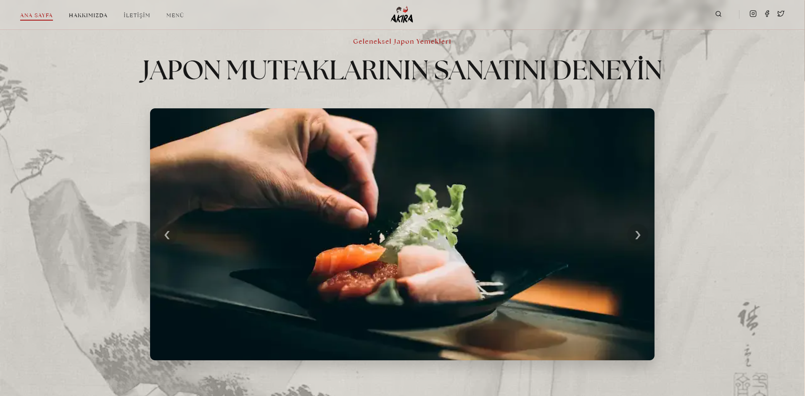
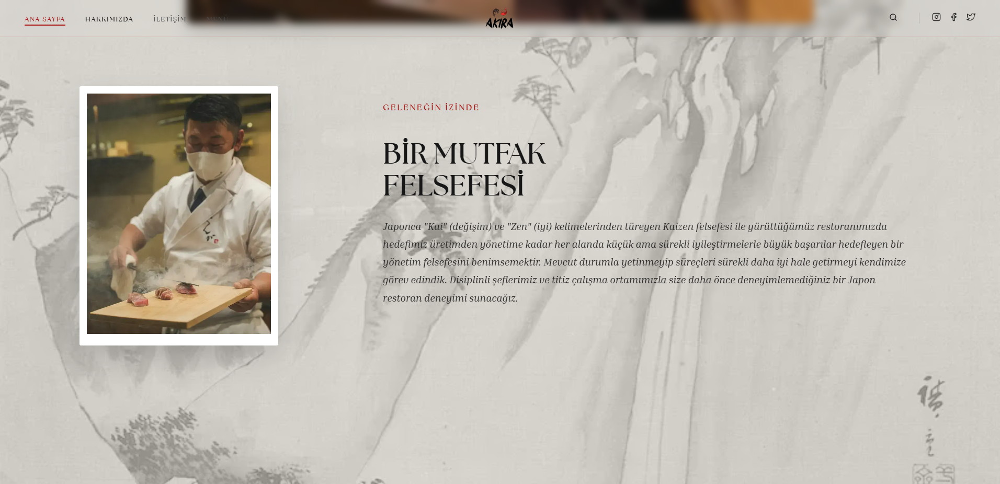
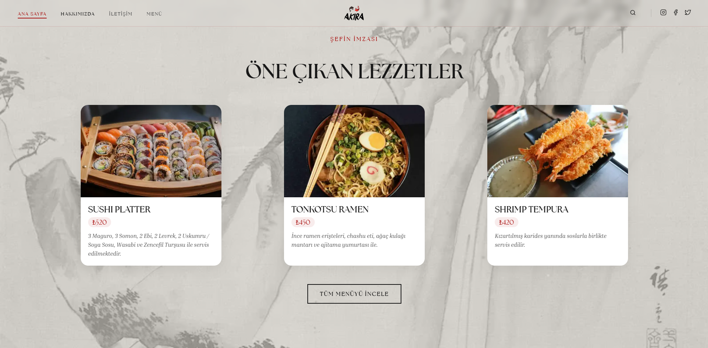
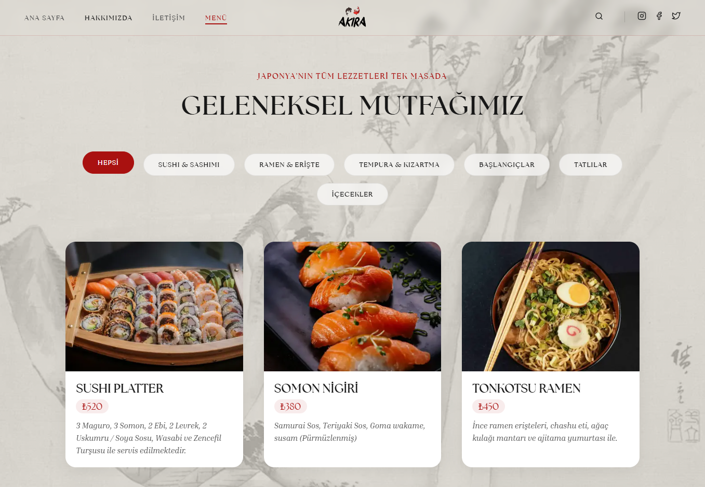
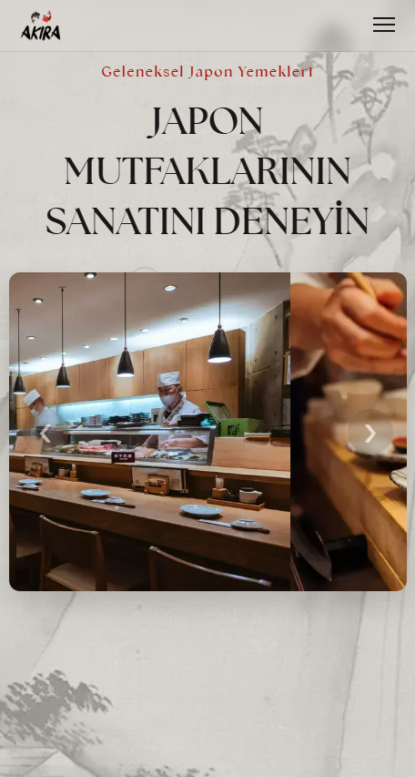
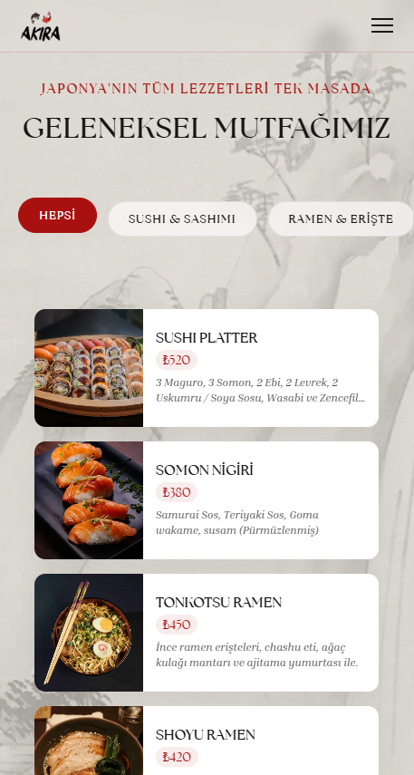

# Akira — Japon Restoranı Web Sitesi

[](https://osmanbabayigit.github.io/Japanese-restaurant/)
[](https://osmanbabayigit.github.io/Japanese-restaurant/)
[](https://developer.mozilla.org/en-US/docs/Web/HTML)
[](https://developer.mozilla.org/en-US/docs/Web/CSS)
[](https://developer.mozilla.org/en-US/docs/Web/JavaScript)

Minimalist Japon estetiğini modern web teknolojileriyle birleştiren, tek sayfalık yapıya sahip bir restoran web sitesi. Responsive tasarımı, filtrelenebilir menüsü ve rezervasyon formuyla kullanıcıya eksiksiz bir deneyim sunmayı hedefler.

Canlı demo: **[osmanbabayigit.github.io/Japanese-restaurant](https://osmanbabayigit.github.io/Japanese-restaurant/)**

---

## Ekran Görüntüleri

**Ana Sayfa — Masaüstü**


**Hakkımızda Bölümü**


**Öne Çıkan Lezzetler**


**Menü Sayfası — Masaüstü**


**Mobil Görünümler**

| Ana Sayfa | Menü |
|:---:|:---:|
|  |  |

---

## Özellikler

**Genel**
- Tüm ekran boyutlarına uyumlu responsive tasarım (mobil, tablet, masaüstü)
- Sayfa yüklenirken görüntülenen özel loading ekranı
- Smooth scroll ile bölümler arası geçiş

**Ana Sayfa**
- Otomatik geçişli ve manuel kontrollü görsel slider (carousel)
- Felsefe ve hikaye bölümü (Kaizen konsepti)
- Şefin öne çıkardığı imza yemekleri

**Menü Sayfası**
- Kategori bazlı filtreleme sistemi (Sushi & Sashimi, Ramen & Erişteler, Tempura, Başlangıçlar, Tatlılar, İçecekler)
- Her ürün için görsel, başlık, fiyat ve açıklama kartları

**Rezervasyon & İletişim**
- Müşteri adı, e-posta, tarih, kişi sayısı ve mesaj alanlarına sahip rezervasyon formu
- Form gönderimi sonrası kullanıcıya onay mesajı gösterimi
- Adres, telefon, e-posta ve çalışma saatleri bilgileri

**Performans & SEO**
- Tüm görseller `.webp` formatına dönüştürülerek dosya boyutu minimize edilmiştir
- Google Lighthouse metrikleri gözetilerek yapılandırılmış HTML semantiği
- `meta description` ve `viewport` etiketleriyle SEO ve mobil uyumluluk sağlanmıştır

---

## Kullanılan Teknolojiler

| Teknoloji | Kullanım Amacı |
|---|---|
| HTML5 | Sayfa yapısı ve semantik işaretleme |
| CSS3 | Görsel tasarım, animasyonlar, responsive layout |
| Vanilla JavaScript | Slider, menü filtresi, form etkileşimleri |
| WebP | Optimize edilmiş görsel formatı |
| Canva | Görsel tasarım ve grafik üretimi |
| GitHub Pages | Statik site barındırma ve sürekli dağıtım |

Harici bir kütüphane veya framework kullanılmamıştır. Tüm bileşenler sıfırdan yazılmıştır.

---

## Proje Yapısı

```
Japanese-restaurant/
├── index.html          # Ana sayfa
├── menu.html           # Menü sayfası
├── css/
│   ├── anasayfa.css    # Ana sayfaya özel stiller
│   ├── genel.css       # Tüm sayfalarda ortak stiller (navbar, footer vb.)
│   └── menu.css        # Menü sayfasına özel stiller
├── js/
│   ├── menu.js         # Kategori filtreleme sistemi
│   ├── mobil.js        # Mobil navigasyon ve hamburger menü
│   ├── script.js       # Slider, loading ekranı, genel etkileşimler
│   └── search.js       # Arama işlevselliği
└── images/             # WebP formatında optimize görseller
```

---

## Nasıl Çalıştırılır

Projeyi klonlayın ve `index.html` dosyasını tarayıcıda açın:

```bash
git clone https://github.com/osmanbabayigit/Japanese-restaurant.git
cd Japanese-restaurant
```

Ardından `index.html` dosyasına çift tıklayın ya da tarayıcıya sürükleyin.

---

## Dağıtım

Proje, GitHub Pages üzerinde barındırılmaktadır. `main` dalına yapılan her push otomatik olarak canlı ortama yansır. Ayrı bir build adımı ya da CI/CD pipeline'ı gerekmemektedir.

```
main branch  -->  GitHub Pages  -->  https://osmanbabayigit.github.io/Japanese-restaurant/
```

---

## Ekip

| Ad | Rol |
|---|---|
| **[Osman BABAYİĞİT](https://github.com/osmanbabayigit)** | Front-end Geliştirme (HTML, CSS, JS vb.), Kod Mimarisi ve Proje Yapılandırması, Lighthouse Performans ve SEO Optimizasyonları, GitHub Deployment (Sürüm Kontrolü ve Yayınlama) |
| **[Efe Yiğit ALTUN](https://github.com/efeyigitaltun)** | Front-end Geliştirme, UI/UX Tasarımı, Markalama ve Font Optimizasyonu |

---

## Lisans

Bu proje açık kaynak kodlu olup kişisel ve eğitim amaçlı inceleme serbesttir. Ticari kullanım için ekiple iletişime geçiniz.

---

*© 2026 Akira — Tüm hakları saklıdır. 旭*
